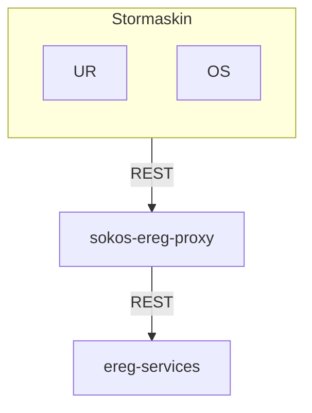

# sokos-ereg-proxy

* [1. Dokumentasjon](dokumentasjon/dokumentasjon.md)
* [2. Funksjonelle krav](#2-funksjonelle-krav)
* [3. Utviklingsmiljø](#3-utviklingsmiljø)
* [4. Programvarearkitektur](#4-programvarearkitektur)
* [5. Deployment](#5-deployment)
* [6. Autentisering](#6-autentisering)
* [7. Drift og støtte](#7-drift-og-støtte)
* [8. Swagger](#8-swagger)
* [9. Henvendelser](#9-henvendelser)

---

# 2. Funksjonelle Krav

Proxy tjeneste som lar z/OS Connect kalle Ereg for å hente data om en virksomhet basert på organisasjonsnummer.

# 3. Utviklingsmiljø

### Forutsetninger

* Java 25
* [Gradle](https://gradle.org/)
* [Kotest IntelliJ Plugin](https://plugins.jetbrains.com/plugin/14080-kotest)

### Bygge prosjekt

`./gradlew build installDist`

### Lokal utvikling

For å kjøre applikasjonen lokalt må du gjøre følgende:

- Kjør scriptet [setupLocalEnvironment.sh](setupLocalEnvironment.sh)
  ```
  chmod 755 setupLocalEnvironment.sh && ./setupLocalEnvironment.sh
  ```
  Denne vil opprette [default.properties](defaults.properties) med alle environment variabler du trenger for å kjøre
  applikasjonen som er definert i [PropertiesConfig](src/main/kotlin/no/nav/sokos/spk/mottak/config/PropertiesConfig.kt).

# 4. Programvarearkitektur


# 5. Deployment

Distribusjon av tjenesten er gjort med bruk av Github Actions.
[sokos-ereg-proxy CI / CD](https://github.com/navikt/sokos-ereg-proxy/actions)

Push/merge til main branche vil teste, bygge og deploye til produksjonsmiljø og testmiljø.

# 6. Autentisering

Applikasjonen bruker ingen autentisering fra klient eller mot ereg.

# 7. Drift og støtte

### Logging

Feilmeldinger og infomeldinger som ikke innheholder sensitive data logges til [Grafana Loki](https://docs.nais.io/observability/logging/#grafana-loki).  
Sensitive meldinger logges til [Team Logs](https://doc.nais.io/observability/logging/how-to/team-logs/).

### Kubectl

For dev-gcp:

```shell script
kubectl config use-context dev-gcp
kubectl get pods -n okonomi | grep sokos-ereg-proxy
kubectl logs -f sokos-ereg-proxy-<POD-ID> --namespace okonomi -c sokos-ereg-proxy
```

For prod-gcp:

```shell script
kubectl config use-context prod-gcp
kubectl get pods -n okonomi | grep sokos-ereg-proxy
kubectl logs -f sokos-ereg-proxy-<POD-ID> --namespace okonomi -c sokos-ereg-proxy
```

### Alarmer

Applikasjonen bruker [Grafana Alerting](https://grafana.nav.cloud.nais.io/alerting/) for overvåkning og varsling.

Alarmene overvåker metrics som:

- HTTP-feilrater
- JVM-metrikker

Varsler blir sendt til følgende Slack-kanaler:

- Dev-miljø: [#team-mob-alerts-dev](https://nav-it.slack.com/archives/C042SF2FEQM)
- Prod-miljø: [#team-mob-alerts-prod](https://nav-it.slack.com/archives/C042ESY71GX)

### Grafana

- [sokos-ereg-proxy](https://grafana.nav.cloud.nais.io/d/d1a2ee44-3da0-4d58-a101-4a523d1bc93c/sokos-ereg-proxy?orgId=1&refresh=30s)

---

# 8. Swagger

- [Prod-fss](https://sokos-ereg-proxy.intern.nav.no/organisasjon-proxy/api/v1/docs)
- [Dev-fss-q1](https://sokos-ereg-proxy.dev-fss-q1.intern.dev.nav.no/organisasjon-proxy/api/v1/docs)
- [Dev-fss-q2](https://sokos-ereg-proxy.dev-fss-q2.intern.dev.nav.no/organisasjon-proxy/api/v1/docs)
- [Lokalt](http://localhost:8080/organisasjon-proxy/api/v1/docs)

# 9. Henvendelser og tilgang

Spørsmål knyttet til koden eller prosjektet kan stilles som issues her på Github.
Interne henvendelser kan sendes via Slack i kanalen [#utbetaling](https://nav-it.slack.com/archives/CKZADNFBP)

